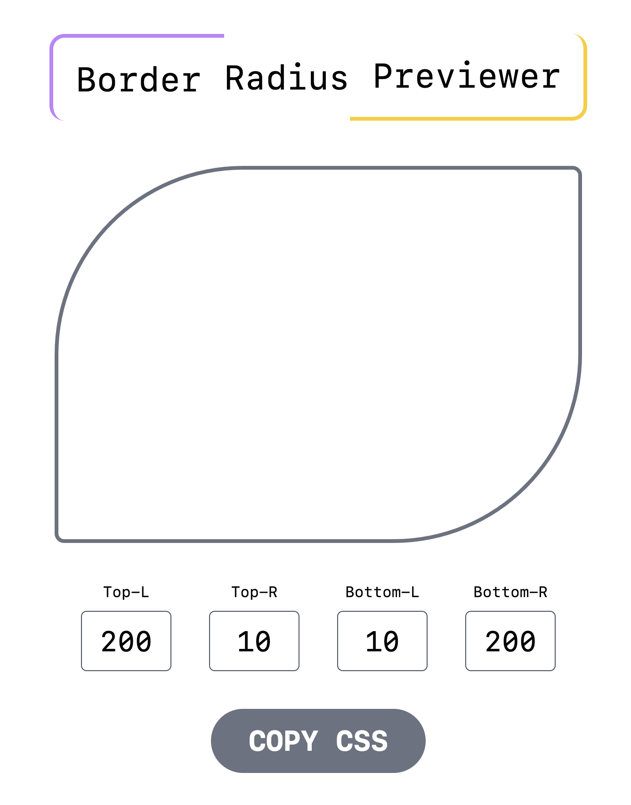
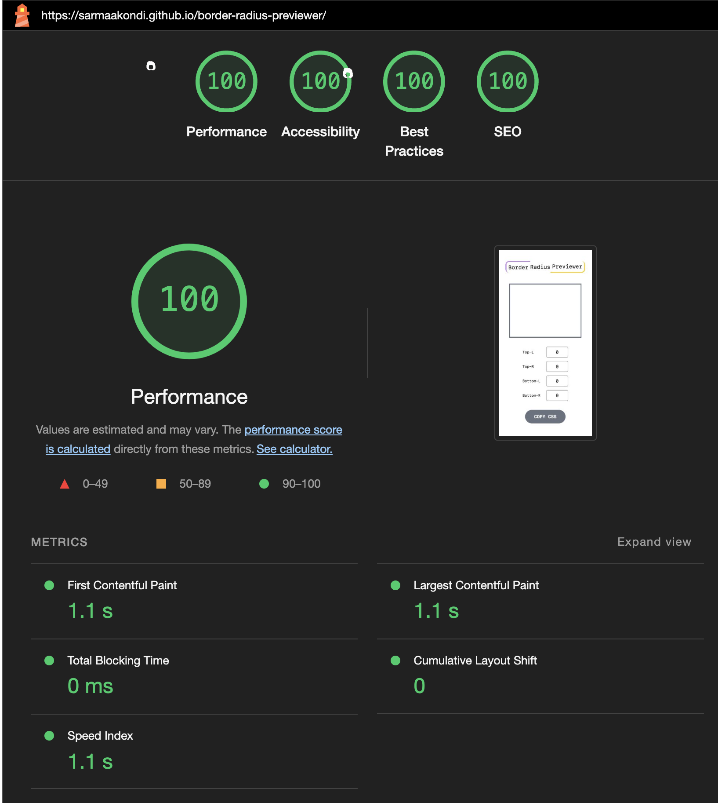

# Border Radius Previewer Tool

This project is a React-based web application designed to provide an intuitive interface for adjusting border-radius properties of a container element. Users can dynamically modify the border-radius values for the top-left, top-right, bottom-left, and bottom-right corners through input fields.

## Features

-   **Interactive Inputs**: Four input fields allow users to enter and adjust the border-radius values for each corner of the container.
-   **Live Preview**: The container element updates in real-time as users modify the border-radius values, providing immediate visual feedback.
-   **CSS Syntax Generation**: Automatically generates the corresponding CSS syntax for the specified border-radius values.
-   **Copy to Clipboard**: A convenient button allows users to copy the generated CSS syntax to their clipboard for easy pasting into their projects.
-   **Validation**: Input validation ensures that only positive numeric values are accepted, and the UI gracefully handles edge cases such as empty inputs.
-   **Responsive Design**: Built with Tailwind CSS, the application is responsive and adapts to different screen sizes.

## Technologies Used

-   **React**: For building the user interface and managing state.
-   **Tailwind CSS**: For styling the application with utility-first CSS classes.
-   **JavaScript**: For handling input validation and interactions.

## Installation

To run the application locally, follow these steps:

1. Clone the repository:
    ```bash
    git clone https://github.com/sarmaakondi/border-radius-previewer.git
    ```
2. Navigate to the project directory:
    ```bash
    cd border-radius-previewer
    ```
3. Install dependencies:
    ```bash
    npm install
    ```
4. Start the development server:
    ```bash
    npm run dev
    ```

## Live App

<a href="https://sarmaakondi.github.io/border-radius-previewer/" target="_blank">Border Radius Previewer</a>

## Usage

1. Open the application in your browser.
2. Enter values in the input fields to adjust the border-radius.
3. Copy the generated CSS syntax using the "COPY CSS" button and paste it into your project.\

## Application Screenshot



## Example

Here's an example of the generated CSS syntax:

```css
border-top-left-radius: 200px;
border-top-right-radius: 10px;
border-bottom-left-radius: 10px;
border-bottom-right-radius: 200px;
```

## Lighthouse Scores for Desktop and Mobile

-   **Performance**: 100/100
-   **Accessibility**: 100/100
-   **Best Practices**: 100/100
-   **SEO**: 100/100

## Lighthouse Report - Desktop


## Lighthouse Report - Mobile



## Contribution

Contributions are welcome! If you find any issues or have suggestions for improvements, please open an issue or submit a pull request.
